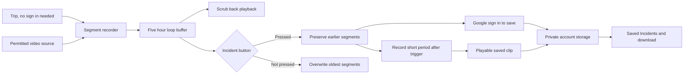

# iWitness

## ShellHacks 2026 project brief for the team and VS Code agents

**Track:** State Farm Auto Insurance Challenge  
**Team:** Three people  
**User:** A student driving without a personal dashcam  
**One sentence:** iWitness keeps a dashcam style five hour loop recording of a permitted roadside camera stream during a trip, lets anyone watch and scrub back through it without an account, and saves incident video blocks to the student's private account after a Google sign in.

> **Hackathon rule:** The best code rarely wins. The best combination of working code, a clear story, and a memorable presentation does. Build toward one convincing live moment, then rehearse it.

## The idea

FL511 lets people view traffic cameras but says its video and images are neither stored nor recorded. A driver involved in a crash may later wish a nearby camera view had been saved. iWitness demonstrates an opt in recording buffer for a roadside camera along the driver's trip. A manual incident trigger preserves recent video and makes it easy to play back or download.

This MVP is **video preservation with account history**. It has no wet road classifier, weather warning, crash detector, fault estimator, claims chatbot, or insurer integration. The technical value is capturing a fleeting video source, maintaining a five hour loop buffer, and turning an incident trigger into a durable clip the student can find later in their account.

The State Farm connection is preparation for an accident and a simpler way to retain potentially useful road context. A fixed camera may be pointed away from the collision. The clip may not show the student's vehicle.

## The demo judges should see

Keep the main demo to about 75 seconds.

1. Open iWitness signed out and start a simulated trip with one roadside camera. Its video plays in iWitness.
2. Scrub the player back to show that the backend has been recording a loop buffer, including footage from before the current moment.
3. Press **I was in an incident**. The app immediately preserves footage from before the press and starts recording a short period after it, then asks the student to sign in with Google to save it.
4. After sign in, open **Saved Incidents**. The new incident appears as a video block with the camera name, source, actual recording window, and trigger time. Play it and scrub to footage from before the press.
5. Sign out and sign back in with the same Google account. The incident block is still there and can be played or downloaded.

**The memorable moment:** A judge presses the incident button and immediately watches video from *before* the button press. That is the product in one interaction.

The team must demonstrate real recording of video, not a slideshow of still images presented as video. If the source only updates snapshots periodically, label the output a time lapse. Choose a permitted continuous video source for the judged MVP if FDOT stream reuse is not authorized or technically available.

## MVP acceptance criteria

The MVP is complete when all of these work end to end:

* One permitted continuous video source is playable in the app.
* Viewing the live stream and scrubbing the loop buffer work without signing in.
* Saving an incident requires Google sign in, which creates or identifies a user account. Signing in after the press does not lose any preserved footage.
* The backend records it into short playable segments while a trip is active.
* A trip without an incident retains a five hour loop. When full, the oldest temporary segment is overwritten, dashcam style. Retention is a setting so the demo can use a shorter loop.
* The incident button preserves the available earlier segments and records a short period afterward.
* The preserved recording plays as one MP4 clip or a clearly ordered set of clips.
* A private **Saved Incidents** page lists that account's preserved video blocks in time order.
* Each block plays and downloads the actual saved video and shows camera identity, recording start and end, and trigger time.
* Signing out and back in with the same Google account preserves access to those blocks. Another account cannot list or fetch them.
* Reopening a recently viewed incident reuses its valid playback URL and browser cached video data so it starts faster than a first view.
* The judged demo can run without an unstable external network feed.

A permitted video can be replayed through the **same recording pipeline** as live input for the demo. Label it as replayed. The output must be a newly recorded file produced during the demo, not a prebuilt clip revealed after the button press.

## Deliberate cuts

Do not add these until the core demo works and has been rehearsed:

* Multiple cameras, full route matching, background phone tracking, or statewide coverage.
* Computer vision, road condition warnings, vehicle tracking, or automatic crash detection.
* Claims analysis, fault percentages, or direct submission to State Farm.
* PDF reports, payment systems, or a complex map.
* A cryptographic chain of custody. A file hash is optional metadata, not proof of what happened on the road.

One working camera and one saved clip prove the central mechanism.

## Technical design

Use a web app, one backend recording process, and a media recorder such as FFmpeg. Supabase Auth with Google, Postgres, and private Storage is a reasonable way to keep the login, incident records, and videos together. The recorder can write short local segments, for example 10 seconds each. The trip keeps a five hour loop of segments, deleting the oldest temporary segment as each new one arrives once the loop is full. The player can scrub back through the loop through an HLS playlist with a sliding window. On an incident trigger, mark a configurable pre trigger window (a few minutes by default, not the whole loop) for retention and continue recording for a short post incident window. Preserved segments are never overwritten. Then assemble a clip, upload it to private storage, and save the incident record under the authenticated user's ID.

Five hours of video is about 2.2 GB at 1 Mbps or 4.5 GB at 2 Mbps per trip. Record at a modest bitrate and also delete the oldest temporary segments if free disk falls below a floor.

### Sign in only to save

Anyone can start a trip, watch the stream, and scrub the loop without an account. An anonymous trip receives an unguessable trip token held by that browser, and only that browser can fetch its buffer. When a signed out student presses the incident button, the server records the trigger time and preserves segments immediately, then the app prompts Google sign in. After sign in, the backend attaches the pending incident to the verified user only when the request carries both the trip token and a valid auth token. An incident can be claimed once. Unclaimed pending incidents expire after about 15 minutes and their video is deleted. Saved Incidents always requires sign in and ownership.

The frontend sends the user's auth token to the backend. The backend verifies it and derives the user ID from the token. Never trust a user ID supplied in the request body. Every incident list, playback, and download request must check ownership. Use short lived signed playback URLs or an authenticated backend response. Keep video buckets private and do not commit OAuth credentials or service keys.

### Recently viewed video cache

Cache only playback data for videos the signed in user has already opened. Keep a small in memory least recently used cache keyed by **user ID, incident ID, and video version**. Store the signed playback URL only until shortly before it expires, then request a new URL. Reusing the same still valid URL lets the browser reuse its normal HTTP video cache instead of fetching a different signed URL on every click. Set private cache headers on video responses where the storage provider supports them. The player should request metadata first, then stream the video when the user presses play; do not download every incident on the list page.

Limit the cache to a few recently viewed incidents. Clear it on sign out, account switch, clip deletion, and video replacement. Never cache a service key or make the storage bucket public. Do not use a shared server cache of video bytes across users. If the browser cannot reuse media bytes because of the video host's cache headers, keep the URL reuse behavior and show a loading state rather than claiming the media itself is cached.

The acceptance check is simple: open a saved incident, return to the list, and reopen it. The second open should reuse the current signed URL and avoid another playback URL request. After sign out and another account's sign in, the previous account's URL must be gone.

Suggested records:

* `camera`: identifier, name, location, source type, input location, and permission status.
* `user`: Google authenticated user ID and basic display information.
* `trip`: identifier, **user ID** (empty while anonymous), anonymous trip token hash, camera identifier, start time, end time, and state.
* `segment`: trip identifier, file path, actual recording start and end, temporary or preserved status.
* `incident`: identifier, **user ID** (empty until claimed), trip identifier, trigger time, requested clip window, actual clip window, private video path, processing state, and claim state.

**Critical test:** The saved clip must contain footage from before the button press. Prove it with a visible clock or event in the video. Keep the source's own timestamp separate from the time our server received or recorded it.

## Data and rights gate

FL511 publicly shows cameras, but its terms restrict reuse of its content without FDOT's express written consent. A public stream or camera catalog is not permission to archive and republish its video. Use team recorded video, licensed sample footage, or another source with clear permission for the hackathon demo. An authorized FDOT source can be added later.

The ArcGIS `FL511_Traffic_Cameras` layer lists camera metadata and image URLs. It does not establish that those URLs are continuous video streams, that the catalog is a current statewide inventory, or that recording is allowed.

**First build gate:** Take one permitted video source, record 30 seconds into a fresh file, and play it back. Solve this before building the frontend. If FDOT provides only periodically updated stills, use another permitted video source for the MVP and describe FDOT video as a future integration.

## Three person split

| Person | Owns | First handoff |
| --- | --- | --- |
| One | Video input, segment recording, five hour loop retention, buffer playback | A playable new 30 second file from the permitted source |
| Two | Google auth integration, trip ownership, incident state, private storage, playback and download endpoints | A trigger that saves a clip under the verified user and a list endpoint scoped to that user |
| Three | Sign in, trip screen, Saved Incidents page, recently viewed cache, pitch, demo rehearsal | A working trigger to sign in to saved block flow with faster repeat playback |

Agree on the file paths and API responses immediately. Integrate one real recorded segment before adding polish. One person owns the final demo and can cut features to protect it.

## Build order

1. Record a permitted video source and play the resulting file.
2. Split recording into short segments in a five hour loop and play back the buffer with scrubbing.
3. Add the incident trigger, working signed out, and preserve footage from before it.
4. Add Google sign in at save time and attach the pending incident to the verified account.
5. Add post trigger recording, private storage, playback, and download.
6. Add a simple trip UI and Saved Incidents page with accurate time labels.
7. Add the small recently viewed playback cache and clear it on sign out.
8. Rehearse on the judging laptop and prepare a local replay fallback.

If time runs short, skip maps and video effects. The priority is a saved playable clip containing footage from before the incident button was pressed.

## Three minute presentation

* **Problem, 25 seconds:** FL511 displays traffic cameras but says it does not save their video. Useful road context can disappear.
* **Solution, 20 seconds:** iWitness keeps a dashcam style five hour loop recording during an opt in trip and saves the moments that matter to the student's account when they report an incident.
* **Live demo, 75 seconds:** Start the stream signed out, scrub back, press the incident button, sign in to save, then open the new Saved Incidents block and play footage from before the press.
* **Technical proof, 30 seconds:** Explain segment recording, the five hour loop, trigger timing, clip assembly, and private account storage. Sign out and back in to show the recording persists.
* **State Farm fit and limits, 30 seconds:** This helps a student preserve potentially useful context after an accident. The video may not show the incident, and FDOT use would require authorized access.

A defensible opening line is: **“FL511 lets you view traffic cameras, but says it does not save the footage. iWitness shows how a driver could preserve the moments that matter.”** Do not claim there is a camera every mile or that every Florida agency fails to record.

## Claims the team must make accurately

* **Saved video:** Only if the input is a video stream and the output is newly recorded playable video.
* **Earlier footage:** Only the part the loop buffer actually captured. Show the real start and end times.
* **Camera coverage:** A nearby camera does not necessarily see the student's car, lane, or collision.
* **Evidence:** A recording may provide context. It does not prove fault or guarantee that an insurer will use it.
* **Authenticity:** A file hash, if added, can indicate that our stored file has not changed. It cannot prove the source captured a particular event at a particular time.
* **FDOT integration:** Do not claim an FDOT partnership, archive, or approved recording access unless one exists.

## Sources and project history

* [FL511 traffic cameras](https://www.fl511.com/cctv): States that video and images are neither stored nor recorded.
* [FL511 terms](https://www.fl511.com/privacy): Restricts reuse without express written consent.
* [ArcGIS camera layer](https://services.arcgis.com/3wFbqsFPLeKqOlIK/ArcGIS/rest/services/FL511_Traffic_Cameras/FeatureServer/0): Camera metadata layer, not verified continuous video access.
* [Florida auto insurance overview](https://myfloridacfo.com/division/consumers/understanding-insurance/personal-automobile-insurance-overview): Distinguishes coverage types.

The original concept included AI analysis, wet road warnings, and a claim packet. The team explicitly cut those from the MVP. **iWitness is the loop video recorder and incident save flow.** Judges should see it working before hearing about future features.
